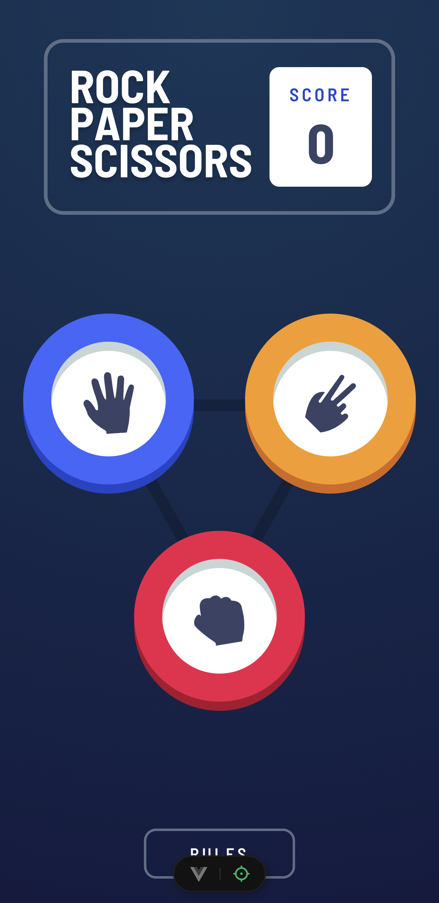

# Frontend Mentor - Rock, Paper, Scissors solution

This is a solution to the [Rock, Paper, Scissors challenge on Frontend Mentor](https://www.frontendmentor.io/challenges/rock-paper-scissors-game-pTgwgvgH). Frontend Mentor challenges help you improve your coding skills by building realistic projects.

## Screenshot



## Built with

- Semantic HTML5 markup
- Flexbox
- CSS Grid
- View Transition API
- [Vue 3](https://vuejs.org/) - JS framework
- [VueUse](https://vueuse.org/) - JS library

## Project Setup

```sh
pnpm install
```

### Compile and Hot-Reload for Development

```sh
pnpm dev
```

### Type-Check, Compile and Minify for Production

```sh
pnpm build
```
